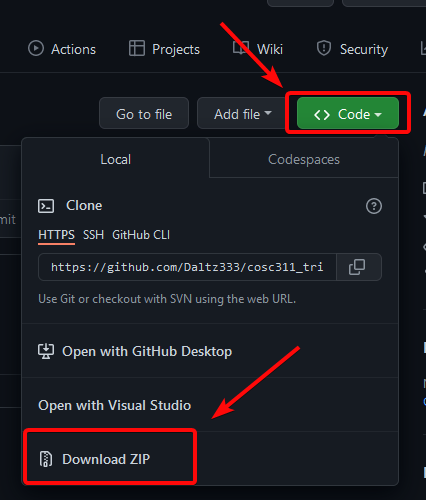
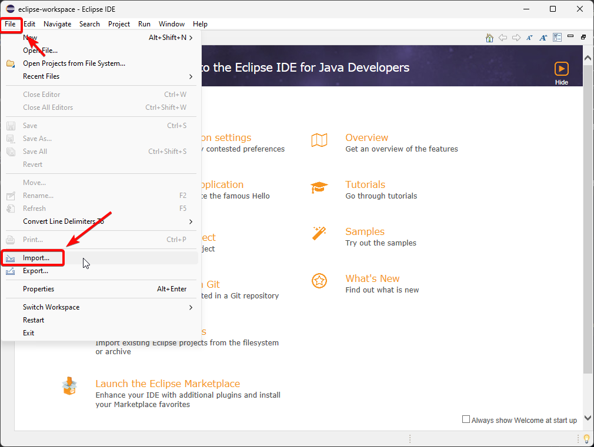
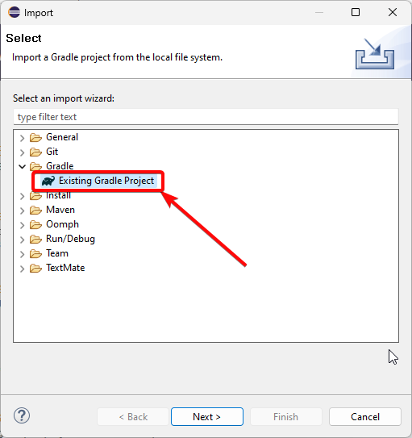
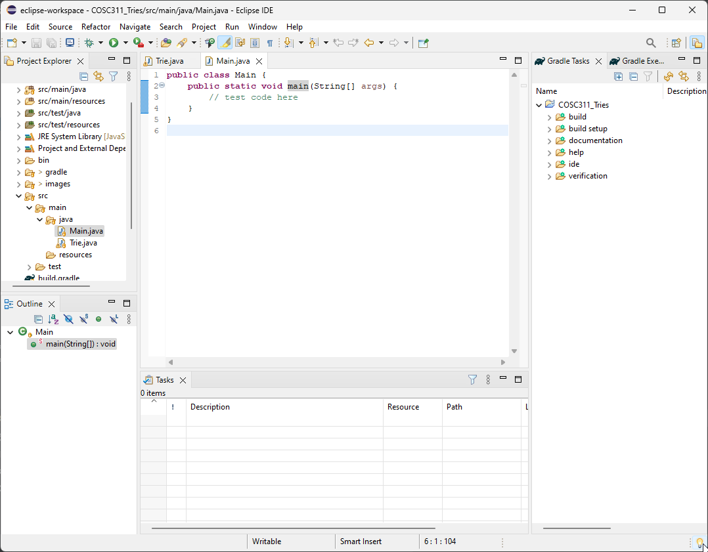

# COSC311 Group Project

This project contains the code implementation for Eastern Michigan University's COSC 311 group project. This project is an implementation of the Tries string tree algorithm.

## How to Download

If you are familiar with [Git](https://git-scm.com/), then you can simply clone this repository with:

```bash
git clone https://github.com/daltz333/cosc311_tries.git
```

If you are not familiar with Git, you can download the project files via the "Code" button in the upper right hand corner.



## Group Members

You should have access to upload and push files to this repository. You can do that via the "Add file" button, or via Git if you are familiar.

## Importing into Eclipse

Importing into Eclipse is super easy! Simply press on "File" and then "Import".



Now click on "Gradle" and then "Existing Gradle Project"



Go through the import menu with all default options. The project should now launch, and you can press the green arrow icon to run the "Main" class.



